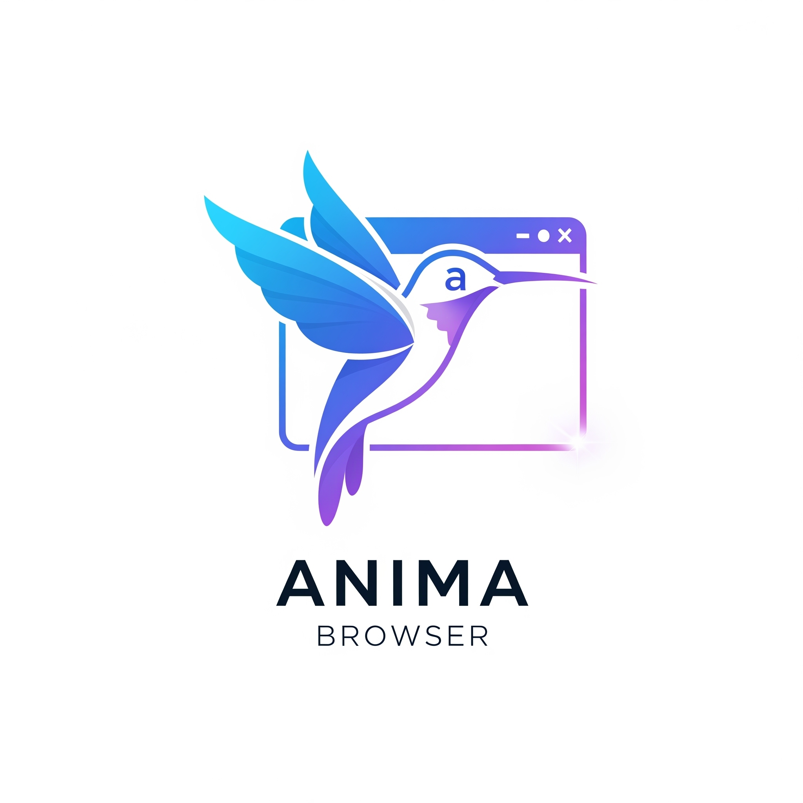

# 🌐 Anima Browser

<p align="center">
  
</p>

**Modern Enterprise Web Browser with Advanced Media Support**

[](https://www.oracle.com/java/)
[](https://openjfx.io/)
[](#license)

## 🚀 Overview
Anima Browser is a cutting-edge desktop web browser built on JavaFX 21 platform, designed for optimal media streaming and modern web standards. It features comprehensive video codec support, advanced streaming optimizations, and enterprise-grade architecture.

## ✨ Key Features

### 🎥 Media & Video Support
- **Advanced Video Codecs**: H.264, H.265, VP8, VP9, AV1, XviD, DivX
- **Audio Codecs**: AAC, MP3, Opus, Vorbis, FLAC, WAV, WMA, AC3, DTS
- **Container Formats**: MP4, WebM, OGG, AVI, MOV, WMV, FLV, MKV, 3GP
- **Streaming Protocols**: HLS, DASH, RTMP, RTSP, MMS
- **YouTube Optimization**: Enhanced thumbnail loading and playback
- **Hardware Acceleration**: GPU-accelerated video decoding

### 🌐 Browser Features
- **Multi-tab Interface**: Efficient tab management with "+" tab creation
- **Navigation Controls**: Back, forward, refresh, home buttons
- **Smart Address Bar**: URL validation and HTTPS auto-upgrade
- **Bookmark Management**: Add, edit, delete, and organize bookmarks
- **Browsing History**: Track and search browsing activity
- **Download Manager**: Handle file downloads with progress tracking
- **Find on Page**: Search within loaded web pages

### 🏗️ Architecture
- **Modular Design**: Clean separation of concerns
- **Media Codec Manager**: Centralized video/audio codec initialization
- **Video Streaming Optimizer**: Platform-specific optimizations
- **System Property Manager**: Centralized configuration management
- **Browser Initializer**: Coordinated component startup sequence

## 📦 Installation & Quick Start

### 🚀 Quick Launch (Recommended)
```bash
# Clone the repository
git clone https://github.com/episkob/Anima-Browser.git
cd Anima-Browser

# Launch with full media optimizations
run-anima.bat          # Windows - Full featured launch
run-simple.bat         # Windows - Simple launch

# Or run directly
java -jar anima-browser.jar
```

### 🔧 Build from Source
```bash
# Requirements: Java 21+ and Maven 3.6+
git clone https://github.com/episkob/Anima-Browser.git
cd Anima-Browser

# Build the project
mvnw.cmd clean package  # Windows
./mvnw clean package    # Linux/Mac

# Run the built application
java -jar target/anima-browser-1.0-SNAPSHOT.jar
```

## ⚙️ System Requirements
- **Java Runtime**: 21 or higher
- **Operating System**: Windows 10/11, Linux, macOS
- **Memory**: Minimum 2GB RAM (4GB recommended for 4K video)
- **Graphics**: DirectX compatible adapter (for hardware acceleration)
- **Storage**: 100MB free space

## 🎯 Usage Examples

### Basic Navigation
```java
// The browser automatically handles URL validation
// Type in address bar: youtube.com → https://youtube.com
// Navigation: Back/Forward buttons, Ctrl+R to refresh
```

### Video Platform Support
- **YouTube**: Optimized thumbnail loading and video playback
- **Vimeo**: Enhanced streaming performance
- **Twitch**: Live stream optimization
- **Netflix/Hulu**: Media element support (where available)

### Keyboard Shortcuts
- `Ctrl+T` - New tab
- `Ctrl+W` - Close tab
- `Ctrl+R` - Refresh page
- `Ctrl+F` - Find on page
- `Ctrl+D` - Add bookmark
- `F5` - Refresh
- `Alt+Left/Right` - Navigate back/forward

## 🏗️ Architecture Overview

### 📁 Project Structure
```
src/main/java/it/r2u/animar2u/
├── AnimaApplication.java          # Main application entry point
├── Launcher.java                  # JavaFX launcher wrapper
├── core/
│   ├── config/
│   │   └── SystemPropertyManager.java    # Centralized configuration
│   ├── initialization/
│   │   └── BrowserInitializer.java       # Component initialization
│   ├── tab_management/
│   │   ├── BrowserTab.java               # Individual tab logic
│   │   └── TabManager.java               # Tab lifecycle management
│   ├── storage/
│   │   ├── BookmarkManager.java          # Bookmark persistence
│   │   ├── DownloadManager.java          # Download handling
│   │   └── Bookmark.java                 # Bookmark model
│   └── navigation/
│       └── HistoryManager.java           # Browsing history
├── media/
│   ├── MediaCodecManager.java            # Video/audio codec setup
│   ├── VideoSettings.java               # Quality optimization
│   └── VideoStreamingOptimizer.java     # Platform-specific tweaks
└── ui/controllers/
    └── MainBrowserController.java        # Main UI controller
```

### 🔧 Key Components

#### MediaCodecManager
- Initializes video/audio codec support
- Configures WebView for optimal media playback
- Handles YouTube and streaming platform optimizations

#### SystemPropertyManager
- Centralizes all JavaFX and WebKit properties
- Manages performance and compatibility settings
- Separates configuration from application logic

#### BrowserTab
- Represents individual browser tabs
- Integrates media optimizations automatically
- Handles navigation, history, and JavaScript execution

## 🚀 Performance Optimizations

### Video Streaming
- **Hardware Acceleration**: GPU-based video decoding
- **Adaptive Quality**: Auto-adjusts based on system capabilities
- **Codec Priority**: Optimal codec selection (H.264 → VP9 → VP8 → AV1)
- **Thumbnail Loading**: Enhanced image rendering for video platforms

### Memory Management
- **G1 Garbage Collector**: Optimized for low-latency applications
- **2GB Heap**: Sufficient for 4K video processing
- **Resource Cleanup**: Proper disposal of WebView resources

### Network Optimization
- **Connection Pooling**: Efficient HTTP/HTTPS handling
- **Proxy Detection**: Automatic system proxy configuration
- **Timeout Management**: Optimized for media streaming

## 🔬 Development

### 🛠️ Development Setup
```bash
# Clone and setup development environment
git clone https://github.com/episkob/Anima-Browser.git
cd Anima-Browser

# Set JAVA_HOME (if needed)
export JAVA_HOME=/path/to/java-21  # Linux/Mac
set JAVA_HOME=C:\Program Files\Java\jdk-21  # Windows

# Build and test
mvnw.cmd clean compile              # Compile only
mvnw.cmd clean package              # Build JAR
test-compile.bat                    # Quick compilation test
```

### 🧪 Testing Media Features
```bash
# Launch with media debugging
java -Djavafx.webkit.media=true \
     -Dwebkit.media.enable=true \
     -jar anima-browser.jar
```

### 📦 Packaging Options

#### Standalone JAR (Recommended)
```bash
mvnw.cmd clean package
# Produces: target/anima-browser-1.0-SNAPSHOT.jar (~40MB)
```

#### Native Executable (Windows)
```bash
mvnw.cmd clean package jpackage:jpackage
# Produces: target/installer/AnimaBrowser/AnimaBrowser.exe
```

## 🤝 Contributing

### Code Style
- **Java 21**: Modern language features preferred
- **JavaDoc**: Document public APIs
- **Modular Design**: Follow existing package structure
- **Error Handling**: Comprehensive exception management

### Architecture Guidelines
1. **Separation of Concerns**: Keep UI, business logic, and media handling separate
2. **Dependency Injection**: Use constructor injection where possible
3. **Resource Management**: Proper cleanup of WebView and media resources
4. **Configuration**: Use SystemPropertyManager for all properties

### Pull Request Process
1. Fork the repository
2. Create feature branch: `git checkout -b feature/awesome-feature`
3. Commit changes: `git commit -m 'Add awesome feature'`
4. Push to branch: `git push origin feature/awesome-feature`
5. Open a Pull Request

## 🐛 Troubleshooting

### Common Issues

#### "JavaFX runtime components are missing"
```bash
# Use the Launcher class instead of AnimaApplication directly
java -cp anima-browser.jar it.r2u.animar2u.Launcher
```

#### Video not playing on YouTube
- Ensure hardware acceleration is enabled
- Check console output for WebKit media errors
- Try launching with `run-anima.bat` for optimal settings

#### High memory usage
- Close unused tabs
- Restart browser periodically for long sessions
- Reduce video quality in browser settings

### Debug Mode
```bash
# Enable verbose logging
java -Djavafx.webkit.logging=true \
     -Dcom.sun.webkit.logging.level=ALL \
     -jar anima-browser.jar
```

## 📈 Roadmap

### Version 1.1 (Planned)
- [ ] Dark/Light theme support
- [ ] Extension system
- [ ] Advanced download manager
- [ ] Session restore
- [ ] Password manager integration

### Version 1.2 (Future)
- [ ] Multi-profile support
- [ ] Advanced privacy controls
- [ ] Developer tools integration
- [ ] Mobile-responsive debugging

## 📄 License
This project is open source software. See the repository for license details.

## 🙏 Acknowledgments
- **JavaFX Team**: For the excellent WebKit integration
- **OpenJFX Community**: For ongoing platform improvements
- **Contributors**: Everyone who helps improve this project

---
**🚀 Powered by JavaFX 21 Platform | Built with ❤️ Web Browsing**

> *Anima Browser - Where Performance Meets Media Excellence*